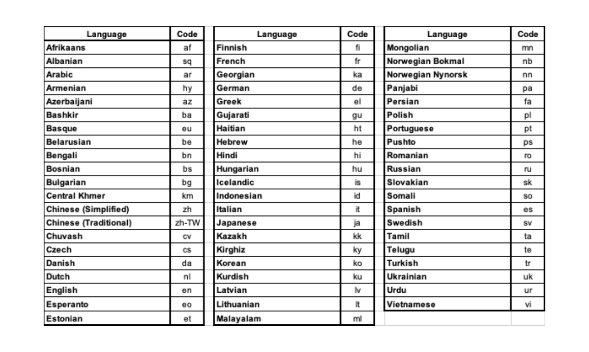

# Language_translator

The project aims to achieve the following goals in sequential order:

1. Creating language translator function using IBM Watson APIs.
2. Writing unit tests to test the functionality of the code written. 
3. Following python coding conventions and verifying the code by running static code analysis. 

<h3>Creating language translator function</h3>
The program translator.py is capable of converting any text from English to any other language or from any other laguage to English. 
 

In translator.py, <API key> and <URL> are to be replaced with the API key and the URL from your instance of Watson Language Translator service.
  
The program takes two inputs:  
  (i) A language code pair - which has language codes of the language from which the translation is required and the language to which the translation is required, both separated       by a '-' .  
  For example, the input en-ru implies that the user wishes to translate text from English to Russian while the input ru-en means that the translation would happen from Russian to   English. 
 (ii) The second input would be the text that the user wishes to translate. 

<h3>Unit testing</h3>
